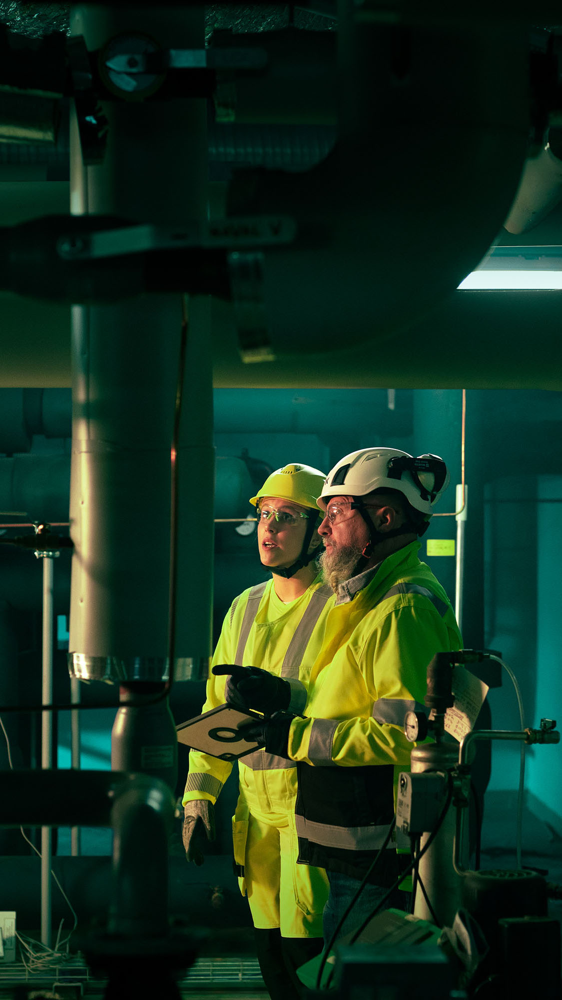
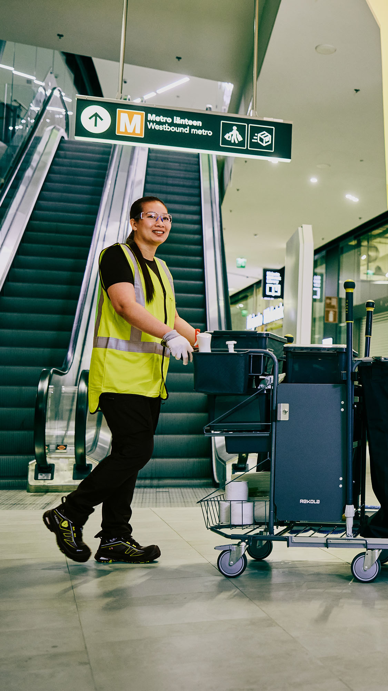
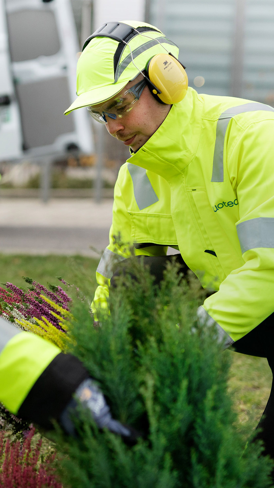

<p align="center">
  <video src="./visual_assets/Logo_Luotea_1080x1080.mp4" width="420" controls>
    🎬 Animated Luotea logo: ./visual_assets/Logo_Luotea_1080x1080.mp4
  </video>
</p>

# 🌿 Luotea Hackathon 2026

## 🔮 Predictive Maintenance – From Calendars to True Operational Reliability

**📅 Date:** 5–7 June 2026  
**🎯 Challenge:** How can building maintenance move from calendar-based thinking to predictive, data-driven management?

## [link to opening presentation materials:](https://drive.google.com/drive/folders/1DNmMsl1auCFxSPB-3NghY-qP6B7VZJ5v?usp=sharing)

Welcome to the **Luotea Hackathon 2026** repository. This repository contains the datasets, dataset documentation, judging criteria, and practical instructions for hackathon participants. 🚀

The goal of the hackathon is to explore how fragmented building maintenance data can be transformed into actionable signals and better operational decisions.

> **data → signals → decisions**

Participants are encouraged to develop a **concept, model, prototype, analysis, dashboard, or service logic** that helps move building maintenance from static schedules and reactive fault handling toward predictive, data-driven operational reliability. 🧠🏢

**🤝 Partners and data contributors referenced in this repository:** Luotea, KIRAHub, KONE, Valmet Technologies Oy, Lentokentänkatu 11, and Valmet Flow Control Oy Hakkila Factory.

---

## 🧩 Challenge Summary

Building maintenance is still largely driven by static maintenance schedules, fault notifications, and assumptions. Maintenance is performed because it is scheduled, not because the risk is increasing. Risks often remain invisible until they materialize for the end user as fault reports. ⚠️

At the same time, there is more data available than ever: fault reports, alarms, energy data, maintenance reports, IoT readings, equipment inventories, and open data. The challenge is not simply the lack of data, but the fragmentation of data and the ability to use it effectively. 🧱📡

In this hackathon, we ask:

- 🔍 What if maintenance was not based on annual schedules, fault reports, or human observation, but on real risk and data?
- 📈 What if data was used not only for reporting, but for continuous risk prediction?
- 🗓️ What if the fixed maintenance schedule evolved in real time based on usage, load, and signals?
- 🛠️ What if failures could be detected before they occur, not only after a fault report?

---

<table>
  <tr>
    <td align="center" width="33%">
      <br />
      <strong>🔧 Technical reliability</strong><br />
      From equipment signals and alarms toward earlier interventions.
    </td>
    <td align="center" width="33%">
      <br />
      <strong>🧹 Facility services</strong><br />
      From fixed routines toward usage-aware service needs.
    </td>
    <td align="center" width="33%">
      <br />
      <strong>🌿 Site environments</strong><br />
      From fragmented observations toward a broader operational picture.
    </td>
  </tr>
</table>

---

## 🏢 Properties and Sites Included in the Data

| Company | Site / Building | Campus | Address | Property ID | Building Code |
|---|---|---|---|---|---|
| Valmet Technologies Oy, Lentokentänkatu 11 | Lentokentänkatu 11 |  | Lentokentänkatu 11, 33900 Tampere | 837-303-0780-0019 | 837-303-780-19-2 |
| Valmet Flow Control Oy Hakkila Factory | Venttiilitehdas | Hakkila | Vanha Porvoontie 229, Vantaa | 92-66-200-20 | 100419457A |
| Valmet Flow Control Oy Hakkila Factory | Toimistotalo | Hakkila | Vanha Porvoontie 229, Vantaa | 92-66-200-20 | 1004194569 |
| Valmet Flow Control Oy Hakkila Factory | STD tehdas | Hakkila | Vanha Porvoontie 229, Vantaa | 92-66-200-20 | 1004194558 |
| Anonymous | Aurora House | Anonymous | Anonymous | Anonymous | Anonymous |
| Anonymous | Meridian Tower | Anonymous | Anonymous | Anonymous | Anonymous |
| Anonymous | Horizon Plaza | Anonymous | Anonymous | Anonymous | Anonymous |

---

## 📊 High-Level Overview of Available Data

The hackathon datasets include a combination of real estate, maintenance, service, alarm, elevator, cleaning, and operational data. Availability varies by site. 🧰

> **Legend:** ✅ Available &nbsp;&nbsp; ❌ Not available &nbsp;&nbsp; ❓ Availability to be confirmed

<table>
  <thead>
    <tr>
      <th align="left">Dataset</th>
      <th class="rotate"><div style="writing-mode: vertical-rl; transform: rotate(180deg); white-space: nowrap;">Lentokentänkatu 11</div></th>
      <th class="rotate"><div style="writing-mode: vertical-rl; transform: rotate(180deg); white-space: nowrap;">Venttiilitehdas</div></th>
      <th class="rotate"><div style="writing-mode: vertical-rl; transform: rotate(180deg); white-space: nowrap;">Toimistotalo</div></th>
      <th class="rotate"><div style="writing-mode: vertical-rl; transform: rotate(180deg); white-space: nowrap;">STD tehdas</div></th>
      <th class="rotate"><div style="writing-mode: vertical-rl; transform: rotate(180deg); white-space: nowrap;">Aurora House</div></th>
      <th class="rotate"><div style="writing-mode: vertical-rl; transform: rotate(180deg); white-space: nowrap;">Meridian Tower</div></th>
      <th class="rotate"><div style="writing-mode: vertical-rl; transform: rotate(180deg); white-space: nowrap;">Horizon Plaza</div></th>
      <th align="left">Notes</th>
    </tr>
  </thead>
  <tbody>
    <tr><td>🧠 Smartti data</td><td align="center">❌</td><td align="center">✅</td><td align="center">❌</td><td align="center">❌</td><td align="center">✅</td><td align="center">✅</td><td align="center">✅</td><td>Smartti data is available for Venttiilitehdas and the anonymous sites.</td></tr>
    <tr><td>🛗 KONE elevator data</td><td align="center">❌</td><td align="center">❌</td><td align="center">❌</td><td align="center">❌</td><td align="center">✅</td><td align="center">✅</td><td align="center">✅</td><td>Available for anonymous sites</td></tr>
    <tr><td>🚨 Alarms</td><td align="center">✅</td><td align="center">✅</td><td align="center">✅</td><td align="center">✅</td><td align="center">✅</td><td align="center">✅</td><td align="center">✅</td><td>Alarms for Aurora House, Meridian Tower, and Horizon Plaza are provided via Smartti JSON files. For the remaining sites, a separate CSV file has been provided.</td></tr>
    <tr><td>🧾 Work orders</td><td align="center">✅</td><td align="center">✅</td><td align="center">✅</td><td align="center">✅</td><td align="center">❌</td><td align="center">❌</td><td align="center">❌</td><td></td></tr>
    <tr><td>🗓️ Maintenance schedule</td><td align="center">✅</td><td align="center">✅</td><td align="center">✅</td><td align="center">❌</td><td align="center">❌</td><td align="center">❌</td><td align="center">❌</td><td></td></tr>
    <tr><td>📝 Maintenance reports</td><td align="center">✅</td><td align="center">✅</td><td align="center">❌</td><td align="center">❌</td><td align="center">❌</td><td align="center">❌</td><td align="center">❌</td><td></td></tr>
    <tr><td>🧹 Needs-based cleaning data</td><td align="center">✅</td><td align="center">❌</td><td align="center">❌</td><td align="center">❌</td><td align="center">❌</td><td align="center">❌</td><td align="center">❌</td><td>Scope of IoT / data-driven cleaning devices covers about 10% of the site. The rest of the site is cleaned conventionally.</td></tr>
    <tr><td>🔧 Service descriptions: technical property maintenance</td><td align="center">✅</td><td align="center">✅</td><td align="center">✅</td><td align="center">✅</td><td align="center">❌</td><td align="center">❌</td><td align="center">❌</td><td>Service descriptions for technical and conventional property maintenance for Venttiilitehdas, Toimistotalo, and STD tehdas can be found in attachment "Liite 4A Palvelupäällikkö Valmet FC Vantaa.pdf".</td></tr>
    <tr><td>🏠 Service descriptions: property maintenance</td><td align="center">✅</td><td align="center">✅</td><td align="center">✅</td><td align="center">✅</td><td align="center">❌</td><td align="center">❌</td><td align="center">❌</td><td>Service descriptions for technical and conventional property maintenance for Venttiilitehdas, Toimistotalo, and STD tehdas can be found in attachment "Liite 4A Palvelupäällikkö Valmet FC Vantaa.pdf".</td></tr>
    <tr><td>✨ Service descriptions: cleaning</td><td align="center">✅</td><td align="center">❌</td><td align="center">✅</td><td align="center">❌</td><td align="center">❌</td><td align="center">❌</td><td align="center">❌</td><td></td></tr>
    <tr><td>🤖 Cleaning robots</td><td align="center">✅</td><td align="center">❌</td><td align="center">❌</td><td align="center">❌</td><td align="center">❌</td><td align="center">❌</td><td align="center">❌</td><td></td></tr>
  </tbody>
</table>

---

## 👥 Mentors

> **ℹ️ Note:** All mentors who are available on site for mentoring are also available for remote sparring.  
> Please book **15–30 minute time slots** directly with the mentor. 🕒

For questions regarding event practicalities or scheduling mentoring times outside the listed availability, please contact:

- **Teemu** — [teemu@kirahub.org](mailto:teemu@kirahub.org), +358 404 56 6108
- **Paavo** — [paavo@kirahub.org](mailto:paavo@kirahub.org), +358 50 325 7836

| Role | Name | Email | Phone | Area of Expertise | Availability |
|---|---|---|---|---|---|
| 🧑‍🏫 Mentor | Matias Riihiaho | [matias.riihiaho@luotea.com](mailto:matias.riihiaho@luotea.com) | +358 50 385 0733 | Data Science & AI, property maintenance and facility services business. Datasets: work order history, maintenance schedules, needs-based cleaning data. | Friday 20:00–21:00 on site. Saturday 10:00–12:00 and 13:00–18:00 on site, 20:00–22:00 remote. |
| 🧑‍🏫 Mentor | Aki Putkiranta | [aki.putkiranta@kone.com](mailto:aki.putkiranta@kone.com) | +358 50 385 4863 | IoT business development, elevator business. | Saturday 13:00–15:00 on site, 20:00–21:00 remote. Call, Teams, or Teams meeting. |
| 🧑‍🏫 Mentor | Kristian Herkman | [kristian.herkman@luotea.com](mailto:kristian.herkman@luotea.com) | +358 50 385 1270 | Business controlling, group reporting, cost forecasting, data management, corporate sustainability reporting, AI. Datasets: work order history, maintenance schedules, needs-based cleaning data. | Friday 20:00–21:00 on site. Saturday 13:00–18:00 on site. |
| 🧑‍🏫 Mentor | Mika Huhtamäki | [mika.huhtamaki@luotea.com](mailto:mika.huhtamaki@luotea.com) | +358 50 385 4863 | Data, business development, SaaS, applied AI. | Friday 20:00–21:30 remote. Saturday 13:00–15:00 on site, 19:30–21:00 remote. |
| 🧑‍🏫 Mentor | Osku Torro | [osku.torro@tuni.fi](mailto:osku.torro@tuni.fi) | 040 747 3375 | IT-business alignment, AI agents, real estate and construction businesses. | Saturday 13:00–14:00 and 16:00–17:00. Available remotely via WhatsApp video call. |
| 🧑‍🏫 Mentor | Juuso Hakala | [juuso.hakala@luotea.com](mailto:juuso.hakala@luotea.com) | +358 50 385 6469 | Operating practices and the reality of day-to-day property maintenance and facility technology. Data content and interpretation. Datasets: work order history, maintenance schedules, maintenance documents. | Friday 16:00–22:00 on site. Saturday 08:00–16:00 on site and 16:30 onwards remote. |

---

## 🗓️ Event Schedule

| Day | Date | Time | Program |
|---|---|---:|---|
| Friday | 5 June | 16:00 | 🚪 Doors open |
| Friday | 5 June | 17:00 | 🎬 Hackathon starts and opening notes |
| Friday | 5 June | 18:00 | 🍽️ Dinner |
| Friday | 5 June | 20:00 | 🧑‍🏫 First mentoring checkpoint |
| Saturday | 6 June | 09:00 | ☕ Breakfast |
| Saturday | 6 June | 12:00 | 🍽️ Lunch |
| Saturday | 6 June | 13:00 | 🧑‍🏫 Second mentoring checkpoint |
| Saturday | 6 June | 18:00 | 🍽️ Dinner |
| Sunday | 7 June | 09:00 | ☕ Breakfast |
| Sunday | 7 June | 12:00 | 🍽️ Lunch |
| Sunday | 7 June | 13:00 | 🎤 Pitching starts and judging |
| Sunday | 7 June | 16:00 | 🏆 Announcement of winners |
| Sunday | 7 June | 16:00 | 🤝 Networking |

---

## 🏆 Judging Criteria

The maximum score is **25 points**.

The full judging criteria are available in the folder:

```text
Judgment criteria
```

### ⭐ Scoring Categories

| Criterion | Points |
|---|---:|
| 1. Impact on real estate business | 1–5 |
| 2. Use of data and analytics | 1–5 |
| 3. Feasibility and scalability | 1–5 |
| 4. Innovation and distinctiveness | 1–5 |
| 5. User, customer and operations perspective | 1–5 |
| **Total** | **5–25** |

### 📏 General Scoring Scale

| Points | Description |
|---:|---|
| 5 | 🌟 Excellent: highly convincing, clearly justified, and directly suitable for further development |
| 4 | ✅ Good: a strong solution with only minor need for refinement |
| 3 | 🟡 Satisfactory: the idea is understandable, but the impact, implementation, or reasoning requires further development |
| 2 | 🟠 Weak: the solution has some interesting elements, but the overall concept remains unclear or incomplete |
| 1 | 🔴 Insufficient: the criterion is met only to a very limited extent, or not at all in practice |

---

# 🚀 Hackathon Challenge

## 🔮 Predictive Maintenance – From Calendars to True Operational Reliability

Building maintenance is still largely driven by static maintenance schedules, fault notifications, and assumptions. Maintenance is performed because it is scheduled, not because the risk is increasing. Risks remain invisible until they materialize for the end user as fault reports. ⚠️

At the same time, there is more data available than ever: fault reports, alarms, energy data, maintenance reports, IoT readings, equipment inventories, and open data. The problem is not a lack of data, but its fragmentation and the ability to use it effectively. 📡

Current data almost always describes the past. It reports, but does not guide. It explains, but does not predict. 📉➡️📈

Predictive maintenance is widely discussed, but it rarely translates into practical operations, contracts, or measurable services. Customers still purchase maintenance visits and working hours, even though the real need is operational reliability and risk management. 🏢🛠️

The biggest pain point is not a single major failure, but recurring small disturbances that accumulate unnoticed as a result of static maintenance and reactive operating models. 🧩

<p align="center">
  
</p>

In this hackathon, we ask:

> 🔍 What if maintenance was not based on annual schedules, fault reports, or human observation, but on real risk and data?

> 📊 What if data was used not only for reporting, but for continuous risk prediction?

> 🗓️ What if the fixed maintenance schedule evolved in real time based on usage, load, and signals?

> 🛠️ What if failures could be detected before they actually occur, not only after a fault report?

At the core of this challenge is a shift:

- ⏱️ From working hours to outcomes
- 🔄 From static to dynamic
- 🔮 From reactive to predictive

Your task is to explore and demonstrate how fragmented data can be transformed into a coherent and actionable overall view:

```text
data → signals → decisions
```

---

## ❓ Hackathon Problem Statement

**How can building maintenance move from calendar-based thinking to predictive, data-driven management?**

---

## 🧭 Key Questions to Guide the Solution

### 1. 📊 Data → Signals → Decisions

Consider the following questions:

- 🔗 How can data from different sources, such as fault reports, alarms, energy data, maintenance reports, and IoT data, be combined into a single view of disruption risk?
- 📉 How can normal variation be distinguished from elevated risk?
- 📏 What kind of metric can reliably and comparably measure operational reliability?
- 🧠 How can fragmented data be transformed into something that actively guides decisions, rather than only reporting retrospectively?

---

### 2. 🗓️ Dynamic Maintenance Calendar and Long-Term Planning

Consider the following questions:

- 🛠️ How could the need for maintenance visits be determined based on risk, usage, or load instead of a fixed calendar?
- 🔄 How could the maintenance calendar evolve in real time based on data?
- ⚖️ How can both over-maintenance and under-maintenance be avoided within the same site?
- 🧱 How can the difference between theoretical lifetime and actual condition be identified?
- ⚠️ How can small disturbances be used to predict larger investment needs?
- 📈 How can data be used for the continuous optimization of the maintenance calendar and long-term planning?

---

## 🎁 Expected Output

Your solution can be a:

- 💡 Concept
- 🤖 Model
- 🧪 Prototype
- 📊 Analysis
- 📈 Dashboard
- 🧰 New service logic
- 🧭 Decision-support tool

The most important element is not a perfect technical implementation, but a shift in thinking:

> **How can maintenance be guided by risk and information, rather than by calendars and reactive behavior?**

Welcome to building the next step toward truly intelligent, predictive maintenance and a more reliable built environment. 🌍✨
